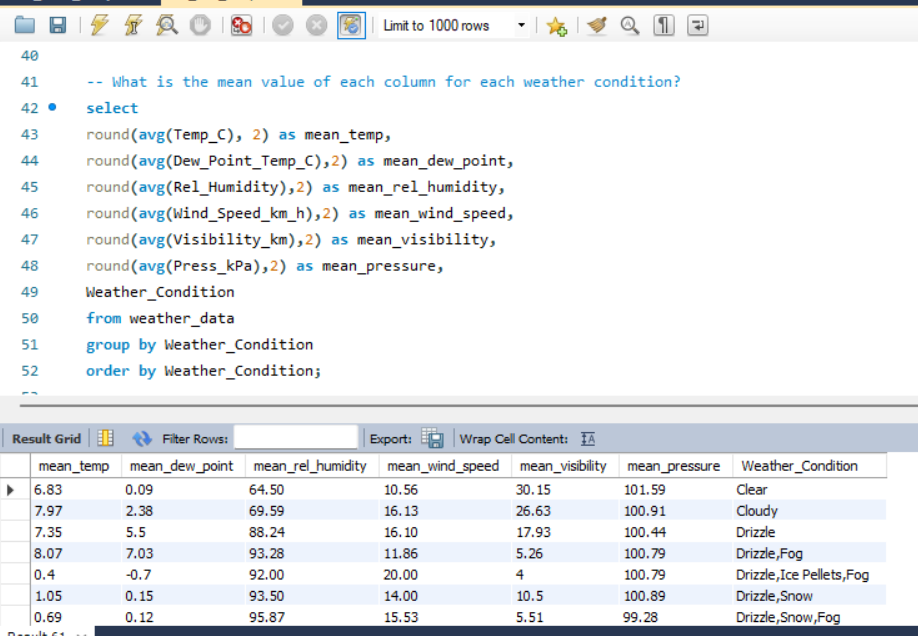

# Analysis of Weather Dataset

### Introduction
This repository contains SQL scripts and Jupyter Notebook that reports the analysis of a weather dataset from Kaggle.
The dataset has been analyzed on both Python and MySQL.

To run this analysis effectively, please ensure the dataset (CSV file) is located in the same directory as the SQL script and Jupyter Notebook.

### The Analysis
The analysis report answers specific questions that have been presented by LuxDev. Underneath every task question below are analysis results as performed on Python and MySQL.

#### Task: From the dataset using pandas and numpy, list the top 10 rows, last 10 rows, the total number of columns and rows in the dataset.
Using the Pandas and Numpy library in Python, the image below shows the top 10 and last 10 records. Also, calling the shape function reveals that there are **8784 records and 8 columns** in this dataset.

#### Task: Find all records where the weather was exactly clear.
The image below shows some of these records, returning a total of **1326** records.

#### Task: Find the number of times the wind speed was exactly 4 km/hr.
Using Python and MySQL, wind speed was exactly 4 km/hr in **474 records.**

#### Task: Check if there are any NULL values present in the dataset.
Analysis in Python and MySQL reveals there are no null values present in this dataset

#### Task: What is the mean visibility of the dataset?
By calling the 'Describe()' function in Python, the mean Visibility was found to be 27.66 km. The same value was obtained by using the 'AVG' aggregrate function in MySQL. 

#### Task: Find the number of records where the wind speed is greater than 24 km/hr and visibility is equal to 25 km.
Analysis in Python and MySQL reveals that a total of **308 records** have wind speeds > 24km/hr and visibility = 25km.

#### Task: What is the mean value of each column for each weather condition?
The screenshot below from MySQL shows some of the mean values of each column for each weather condition. The full analysis can be seen in the SQL script and Jupyter Notebook. On MySQL, the mean was calculated using the 'AVG' aggregate function.

#### Task: Find all instances where the weather is clear and the relative humidity is greater than 50, or visibility is above 40.
Using Python and MySQL, a total of **2921** records had clear weather and relative humidity > 50, or visibility > 40

#### Task: Find the number of weather conditions that include snow.
A total of **19** weather conditions were shown to include snow.

#### Source of Dataset
https://www.kaggle.com/datasets/ayushmi77al/weather-data-set-for-beginners